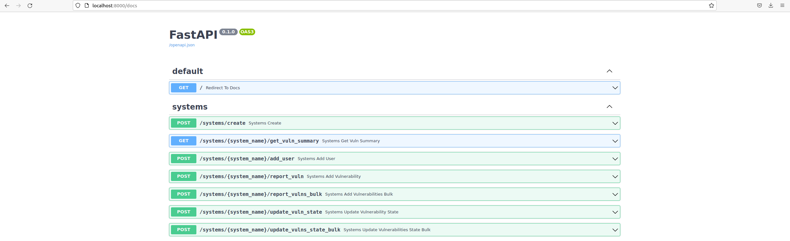
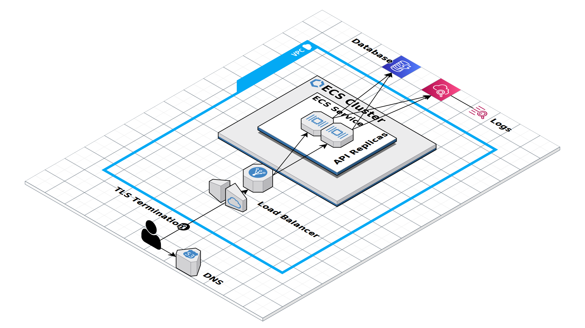

# Vulnerabilit Management API

[](https://codecov.io/gh/andrescl94/vuln-management-api)

This repository contains the code to deploy an API
that lets you manage the known vulnerabilities of a system.

The vulnerabilities reported are cross-checked
against the NIST database to ensure they exist
and to fetch more information about them.
These vulnerabilities can then be updated
according to their current state,
whether they are open or have been remeadiated.

A summary of this information can be retrieved for each system,
obtaining the number of vulnerabilities reported and their state,
distribution according to the severity and more.

## Stack

This application was built using the following stack:

  - **[Nix](https://nixos.org/)**:
    Package manager that gives maximum immutability and reproducibility.
  - **[DynamoDB](https://aws.amazon.com/dynamodb/)**:
    NoSQL database provided by the AWS cloud.
    It is fast and scalable.
    You can check the data model design [here](resources/db-design.json)
  - **[FastAPI](https://fastapi.tiangolo.com/)**:
    Python framework to build APIs.
    It supports asynchronous Python for high performance
    and static typing for better code quality.
    It also makes input validation very easy
    and generates documenation automatically out-of-the-box.

## Getting Started

### Using Nix

1. [Install Nix](https://nixos.org/download.html)
following the guide for your OS.
2. [Enable Flakes](https://nixos.wiki/wiki/Flakes#Enable_flakes)
experimental features
3. Download the repository, go to its root and execute:
```
nix run
```
This will download all the dependencies required by the application.
It could take some time depending of your Internet connection,
so go grab a cup of coffee and come back later to find the application deployed.
You can then access it by going to `http://localhost:8000`
and it should redirect you to the API documentation



#### Useful commands

With Nix installed and Flakes enabled, you can use the following commands:

1. `nix develop`:
This will prompt you a shell
that has all the required dependencies and Python libraries
to modify the application code
2. `nix run .#deployDynamoDb`:
This command will deploy a local instance of DynamoDB
with the database configuration specified [here](infra/main.tf).
It can be reached at `http://localhost:8022`
3. `nix run .#docker`:
This will build a Docker image to execute the application from a container

### Using Docker

1. Pull the image:
```
docker pull zalera0601/vuln-management-api:main
```
This image was built using the command `nix run .#docker`
in case some users do not want to go the Nix route.

2. Run the container:
```
docker run -ti -p 8000:8000 -v /tmp:/tmp -v /etc:/etc zalera0601/vuln-management-api:main
```
A quick run of the flags sent to Docker:
  - `-ti`: Have an interactive shell where we can see the container logs
  - `-p 8000:8000`: Bind the port 8000 of the container with our internal network
  so the application can be reached at `http://localhost:8000`
  - `-v /tmp:/tmp`: Mount the `/tmp` directory inside the container.
  This is required at the moment to deploy the local instance of DynamoDb.
  It may be removed in the future.
  - `-v /etc:/etc`: Mount the `/etc` directory inside the cotnainer.
  This is required at the moment
  so Terraform has access to the CA certificates
  and can download the providers needed.
  It may be removed in the future.

## Using the API

I am not going to enter into too much detail here,
since that was the idea of using a framework
that generates its own documentation. I'll leave you a few examples:

1. **Login**: Go to `http://localhost:8000/login`.
The application uses Google OAuth,
so it will redirect you to finish your login process with google.
After being successfully logged in, you will get this reponse:
```
{
    "expiration_date": ...,  # 7 days by default
    "jwt_token": ...,
    "success": true
}
```
Save the JWT provided in the response,
you will need it for the following requests.
**It will only be generated once when you log in for the first time**

**Since the OAuth credentials are for an application that is not released,
the email must be added in the credentials configuration in GCP.**


2. **Create a system**:
```
curl  -Lk -H "Authentication: Bearer $JWT" -H "Content-Type: application/json" --data '{"name": "$NAME", "description": "$DESCRIPTION"}' http://localhost:8000/systems/create
```
Where:
  - **JWT** is the token obtained after login
  - **NAME** is the name of the system to create
  - **DESCRIPTION** is a brief description of the system

Example:
```
curl  -Lk -H "Authentication: Bearer $JWT" -H "Content-Type: application/json" --data '{"name": "testsystem", "description": "Test System"}' http://localhost:8000/systems/create
```
Result:
```
{"success": true}
```

3. **Report vulnerabilities**:
```
curl  -Lk -H "Authentication: Bearer $JWT" -H "Content-Type: application/json" --data '[{"cve": "$CVE1"}, {"cve": "$CVE2"}, {"cve": "$CVE3"}]' http://localhost:8000/systems/$NAME/report_vulns_bulk
```
Where:
  - **JWT** is the token obtained after login
  - **CVE{NUM}** are the CVE IDs you want to report to the system

Example:
```
curl  -Lk -H "Authentication: Bearer $JWT" -H "Content-Type: application/json" --data '[{"cve": "CVE-2019-1234"}, {"cve": "cve-2022-1234"}, {"cve": "CVE-2200-1234"}]' http://localhost:8000/systems/testsystem/report_vulns_bulk
```
Result:
```
[
    {"success":true,"details":"","item":"cve-2019-1234"},
    {"success":true,"details":"","item":"cve-2022-1234"},
    {"success":false,"details":"The CVE you provided does not exist in the NIST database","item":"cve-2200-1234"}
]
```

4. **Update vulnerability state**:
```
curl  -Lk -H "Authentication: Bearer $JWT" -H "Content-Type: application/json" --data '[{"cve": "$CVE1", "state": "$STATE1"},{"cve": "$CVE2", "state": "$STATE2"}]' http://localhost:8000/systems/$NAME/update_vulns_state_bulk
```
Where:
  - **JWT** is the token obtained after login
  - **CVE{NUM}** are the CVE IDs you want to update
  - **STATE{NUM}** are the updated states of the vulnerabilities

Example:
```
curl  -Lk -H "Authentication: Bearer $JWT" -H "Content-Type: application/json" --data '[{"cve": "CVE-2019-1234", "state": "remediated"}, {"cve": "CVE-2019-23456", "state": "remediated"}]' http://localhost:8000/systems/testsystem/update_vulns_state_bulk
```
Result:
```
[
    {"success":true,"details":"","item":"cve-2019-1234"},
    {"success":false,"details":"Vulnerability does not exist in the system","item":"cve-2019-23456"}
]
```

5. **Get vulnerability summary**:
```
curl  -Lk -H "Authentication: Bearer $JWT" -H "Content-Type: application/json" http://localhost:8000/systems/$NAME/get_vuln_summary?detailed=$DETAILED
```
Where:
  - **JWT** is the token obtained after login
  - **DETAILED** is a flag to set if you want more information in the summary.
  Defaults to false.

Example:
```
curl  -Lk -H "Authentication: Bearer $JWT" -H "Content-Type: application/json" http://localhost:8000/systems/testsystem/get_vuln_summary
```
Result:
```
{
    "summary":{"total_vulns":2,"total_open_vulns":1,"total_remediated_vulns":1},
    "summary_by_severity":[
        {
            "severity":"unknown",
            "summary":{"total_vulns":0,"total_open_vulns":0,"total_remediated_vulns":0},
            "details":null
        },
        {
            "severity":"low",
            "summary":{"total_vulns":0,"total_open_vulns":0,"total_remediated_vulns":0},
            "details":null
        },
        {
            "severity":"medium",
            "summary":{"total_vulns":1,"total_open_vulns":1,"total_remediated_vulns":0},
            "details":null
        },
        {
            "severity":"high",
            "summary":{"total_vulns":1,"total_open_vulns":0,"total_remediated_vulns":1},
            "details":null
        },
        {
            "severity":"critical",
            "summary":{"total_vulns":0,"total_open_vulns":0,"total_remediated_vulns":0},
            "details":null
        }
    ]
}

If detailed is true
{
    "summary":{"total_vulns":2,"total_open_vulns":1,"total_remediated_vulns":1},
    "summary_by_severity":[
        {
            "severity":"unknown",
            "summary":{"total_vulns":0,"total_open_vulns":0,"total_remediated_vulns":0},
            "details":[]
        },
        {
            "severity":"low",
            "summary":{"total_vulns":0,"total_open_vulns":0,"total_remediated_vulns":0},
            "details":[]
        },
        {
            "severity":"medium",
            "summary":{"total_vulns":1,"total_open_vulns":1,"total_remediated_vulns":0},
            "details":[
                {
                    "cve":"cve-2022-1234",
                    "description":"XSS in livehelperchat in GitHub repository livehelperchat/livehelperchat prior to 3.97. This vulnerability has the potential to deface websites, result in compromised user accounts, and can run malicious code on web pages, which can lead to a compromise of the user’s device.",
                    "references":["https://github.com/livehelperchat/livehelperchat/commit/a09aa0d793818dc4cae78ac4bcfb557d4fd2a30d","https://huntr.dev/bounties/0d235252-0882-4053-85c1-b41b94c814d4"],
                    "severity":"medium",
                    "severity_score":6.1,
                    "state":"open"
                }
            ]
        },
        {
            "severity":"high",
            "summary":{"total_vulns":1,"total_open_vulns":0,"total_remediated_vulns":1},
            "details":[
                {
                    "cve":"cve-2019-1234",
                    "description":"A spoofing vulnerability exists when Azure Stack fails to validate certain requests, aka 'Azure Stack Spoofing Vulnerability'.",
                    "references":["https://portal.msrc.microsoft.com/en-US/security-guidance/advisory/CVE-2019-1234","https://research.checkpoint.com/2020/remote-cloud-execution-critical-vulnerabilities-in-azure-cloud-infrastructure-part-i/"],
                    "severity":"high",
                    "severity_score":7.5,
                    "state":"remediated"
                }
            ]
        },
        {
            "severity":"critical",
            "summary":{"total_vulns":0,"total_open_vulns":0,"total_remediated_vulns":0},
            "details":[]
        }
    ]
}
```

You can check the documentation for more information.

## Deployment in the Cloud



### Resources

- **Route53**: It will be used to set up the DNS records.
- **VPC**: Private network where the resources will be deployed.
- **ALB**: Load Balancer to handle the traffic incoming to the application
and provide TLS termination.
- **ECS**: A set of replicas of the API container will be deployed.
This architecture will allow us to easily scale over time.
- **DynamoDB**: It will be used as the main database of the application.
- **CloudWatch Logs**: Streams where the application will send access logs
for traceability purposes.

## Next Steps
1. **Test coverage**:
Although the application was tested dynamically in the local environmment,
it is necessary to write some automatic tests
that ensure the new code does not break any existing functionality.
It can be added as a new stage of the pipeline.
2. **Secret handling**:
Due to time constraints, the secrets and keys required by the application
are stored in the repository in plain-text.
This is a serious security issue.
One way to fix this could be to use [SOPS](https://github.com/mozilla/sops)
to encrypt the secrets.
They must be rotated before.
3. **Improve CI**:
Add more stages to the Actions workflows like:
    - Backend tests
    - Infrastructure deployment
    - Application deployment
4. **Cloud deployment**:
Add the Terraform code required to deploy the proposed diagram in AWS infrastructure

## Contact

andres.cuberos94@gmail.com
